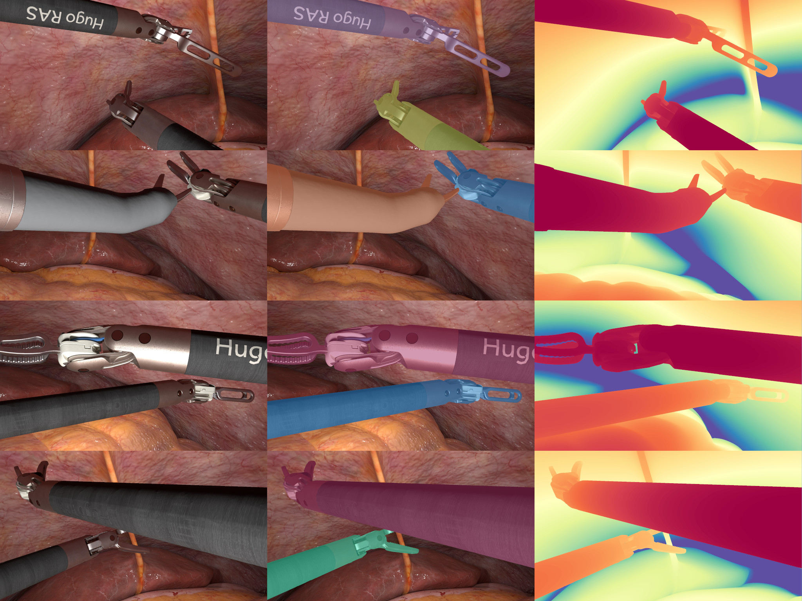
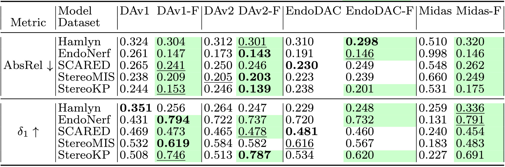
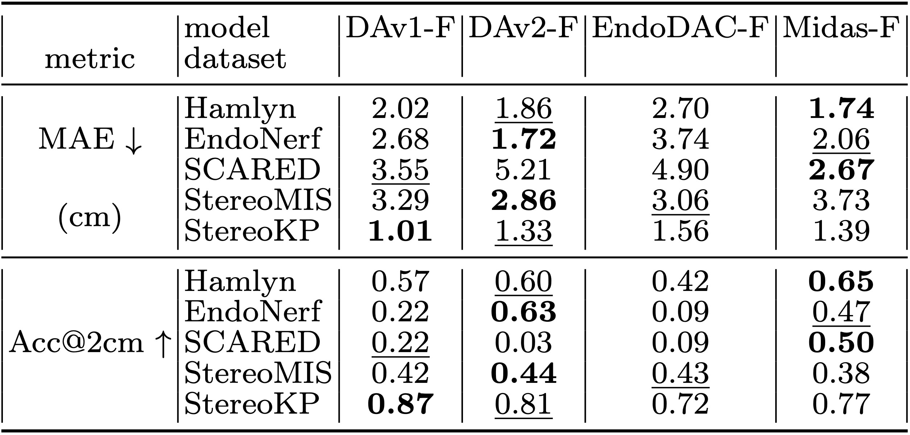
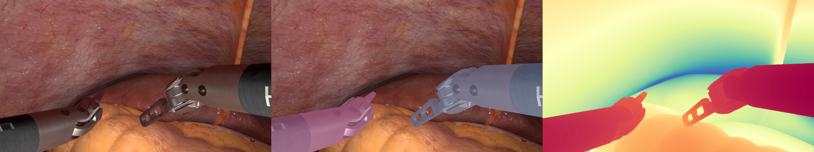

# EndoSynth: Zero-shot Monocular Metric Depth for Endoscopic Images




This is the official repository for our paper presented at MICCAI 2025 [Data Engineering in Medical Imaging](https://demi-workshop.github.io/#/workshop-details) workshop.

**Zero-shot Monocular Metric Depth for Endoscopic Images**, *Nicolas Toussaint, Emanuele Colleoni, Ricardo Sanchez-Matilla, Joshua
Sutcliffe, Vanessa Thompson, Muhammad Asad, Imanol Luengo, and Danail Stoyanov*

[ [MICCAI](), [arXiv]() ]

## Main contributions

* **EndoSynth: novel synthetic dataset** of endoscopic surgical instruments with ground truth metric depth: a new synthetic dataset featuring endoscopic HugoTM RAS surgical instruments paired with precise ground truth metric depth and segmentation masks.

* **Benchmark of SOTA depth models**: Comprehensive evaluation of leading depth estimation models on several publicly available endoscopic datasets as well as on an in-house clinical dataset for the task of metric depth estimation, with and without fine-tuning with *EndoSynth*.


## Benchmark


### Relative depth


&uarr; Zero shot **relative** performances recorded before and after (-F) fine-tuning each model using `EndoSynth` dataset (**best**, <u>second-best</u>, <span style="background-color: #24e387;">improved</span>).

### Metric depth


&uarr; Zero shot **metric** depth performances recorded after fine-tuning each model using `EndoSynth` dataset (**best**, <u>second-best</u>).

## Weights

| Model   | acc@2cm | # params | github | fine-tuned `EndoSynth` (-F) |
|:--------|--------:|---------:|:---------|---------:|
| DAv1    | 0.87    | 97M      | [LiheYoung/Depth-Anything](https://github.com/LiheYoung/Depth-Anything) | [ckpt]() |
| DAv2    | 0.81    | 97M      | [DepthAnything-V2](https://github.com/DepthAnything/Depth-Anything-V2)| [ckpt]() |
| EndoDAC | 0.72    | 42M      | [BeileiCui/EndoDAC](https://github.com/BeileiCui/EndoDAC)| [ckpt]() |
| MIDAS   | 0.77    | 345M     | [isl-org/MiDaS](https://github.com/isl-org/MiDaS) | [ckpt]() |


---

:warning: **By downloading this dataset you are agreeing in our [LICENSE](LICENSE.txt) terms**

---

```bash

mkdir -p checkpoints
wget <weights_uri> -P checkpoints
```


## Dataset

Please find the `EndoSynth` dataset as in [this following download link]() [zipped folder]

---

:warning: **By downloading this dataset you are agreeing in our [LICENSE](LICENSE.txt) terms**

---


```bash

wget <endosynth_uri>
mkdir -p datasets
unzip <EndoSynth-v1.0.zip> -d datasets
```

### Folder Structure
```
EndoSynth
|____LICENSE.txt
|____samples
| |____000000.npz
| |____000001.npz
| |____000002.npz
| |____...
| |____002403.npz
```

### Sample Content

| key   | dtype   | shape         | unit  | range | description |
|:------|:--------|:--------------|:------|:------|:------------|
| rgb   | uint8   | 1080, 1920, 3 | -     | [0,255] | RGB synthetic endoscopic image|
| depth | float16 | 1080, 1920    | meter | ]0,inf[ | metric depth map in meters |
| seg   | uint8   | 1080, 1920    | -     | [0, 6] | semantic segmentation of tools and background |


### Hugo RAS (TM) Tools mapping in `seg`

| class                       | value | description |
|:----------------------------|:------|:------------|
| background                  | 0     | anatomical background|
| cadiere forceps             | 1     | |
| fenestrated bipolar grasper | 2     | |
| double fenestrated grasper  | 3     | |
| needle driver               | 4     | |
| monopolar curved shears     | 5     | |
| maryland bipolar grasper    | 6     | |


### Visualise

```python
from endosynth.utils import sample2png
sample2png(np.load("./datasets/EndoSynth/samples/000010.npz"), "000010.jpg")
```



## Inference

#### Pre-Requisite

- clone DA-V1, DA-v2, EndoDAC and MiDAS from their respective repositories listed above and add each path into `PYTHONPATH`
- download fine-tuned checkpoints listed above into `./checkpoints`
- download `EndSynth` dataset into `./datasets`

```bash
mkdir -p third_party
git clone https://github.com/LiheYoung/Depth-Anything.git third_party/
git clone https://github.com/DepthAnything/Depth-Anything-V2.git third_party/
git clone https://github.com/BeileiCui/EndoDAC.git third_party/
git clone https://github.com/isl-org/MiDaS.git third_party/
export PYTHONPATH=${PWD}/third_party/Depth-Anything:${PYTHONPATH}
export PYTHONPATH=${PWD}/third_party/Depth-Anything-V2:${PYTHONPATH}
export PYTHONPATH=${PWD}/third_party/EndoDAC:${PYTHONPATH}
export PYTHONPATH=${PWD}/third_party/MiDaS:${PYTHONPATH}
```

#### Inference code

```python
from endosynth.models import load
from endosynth.utils import depth2rgb
import numpy as np
from PIL import Image

model = load("dav1")
# model = load("dav2")
# model = load("endodac")
# model = load("midas")
rgb = np.load("./datasets/EndoSynth/samples/000010.npz")["rgb"]
depth = model.infer(rgb)

Image.fromarray(depth2rgb(depth, 0.02, 0.20).astype(np.uint8)).save("out.png")
```

## Citation

If you use this work, weights or dataset, please cite:

```bibtex
@inproceedings{endosynth,
      title={Zero-shot Monocular Metric Depth for Endoscopic Images},
      author={Nicolas Toussaint, Emanuele Colleoni, Ricardo Sanchez-Matilla, Joshua Sutcliffe, Vanessa Thompson, Muhammad Asad, Imanol Luengo, Danail Stoyanov},
      booktitle={Data Engineering for Medical Imaging, MICCAI},
      year={2025}
}
```
